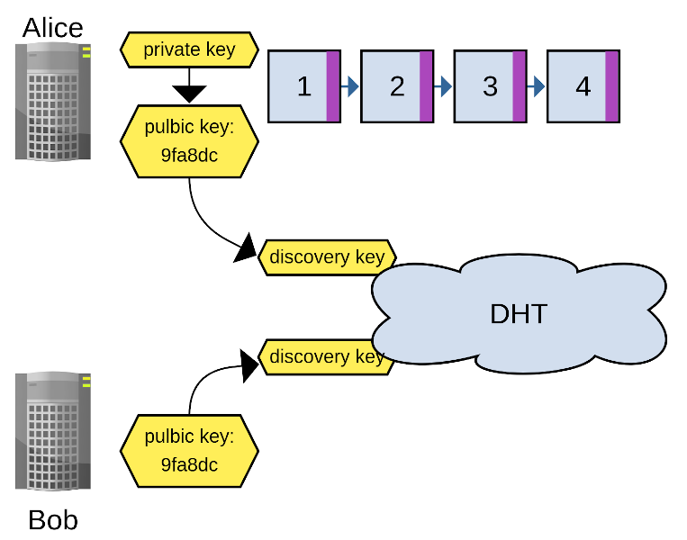

# Sonar

### p2p database & search engine for media libraries

built on top of the Dat stack & the Tantivy search engine

* https://arso.xyz
* https://github.com/arso-project/sonar

---

# what we wanna do

* tools to collectively preserve content
* grassroots initiatives, social movements, activist groups
* collections of zines, videos, posters, radioshows, ...
* full-text search!

---
## goals

* make it easy to clone & seed collections
* forking & extending & remixing
* local-first: work offline

...

---

## goals

...

* extensible & hackable
* p2p & local first with bridges to traditional web
* CLI, UI, API server

---

# tech stack: core

* p2p data structures: Dat protocol
* ...hypercores, hyperdrives
* kappa-style database (materialized view of feeds)
* full-text search engine written in Rust

---

# quick intro to Dat

---

# Hypercore

A cryptographically secure append only log

---

# Hypercore

- Signed log of messages. Single writer!

---

# Hyperdrive

- File system abstraction on top of hypercores
- Single writer
- FUSE support
- Two hypercores per hyperdrive:
    * metadata: trie-based key-value store
    * content: actual file content

---

# hyperswarm

- connect peers interested in a topic
- uses a distributed hash table (DHT) or MDNS (in LAN)
- does NAT hole punching

---

# the sonar stack: core

* store *records* in hypercores (*feeds*)
* store files in hyperdrives
* feeds & drives are grouped into *Islands*

---

## the sonar stack: data model

"kappa database"

* build a materialized local logs of all feeds in an Island
* index this log into secondary views
* ... while applying a simple CRDT

---

* **CRDT**: Conflict-free replicating data types
* when updating a record:
  * store which previous records are made obsolete
* happens automatically: 
  * which current records with the same ID are in my local db?

---

# the sonar stack: semantic model

* working with flexible data models is hard
* but we want to allow domain-specific data models
* e.g. make up your own Zine schema

---

* top end: RDF
* bottom end: json (+ json schema)
* inbetweens

* Currently: (id, schema, value) = record
* the value is validated with JSON schema
* will be expanded to have more semantics

---

# the sonar stack: tools

* sonar-server: HTTP API server
* sonar-cli: Command-line interface
* sonar-ui: Web UI
* soon: sonar-bots

---

# Demo
